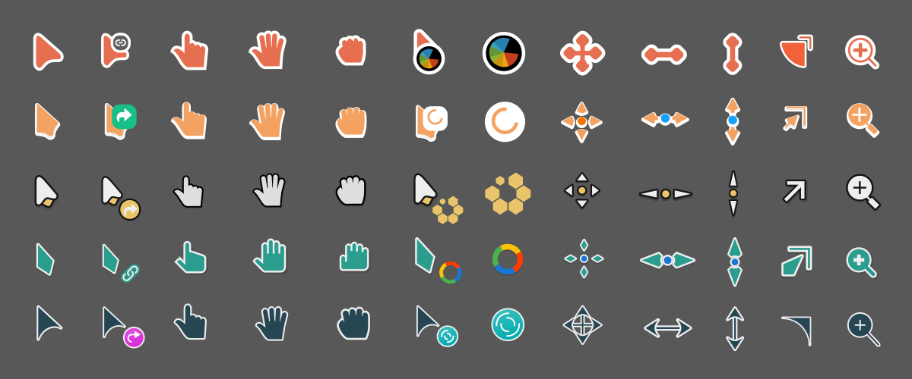

# accurse
Atomsky's cursor packager

## Why?
Theming cursors for different standards is a curse. `accurse` alleviates the
curse by allowing you to package hyprcursor and xcursor in a manageable way.
`accurse` can
- package hyprcursor and xcursor from SVG assets,
- recolor cursor shapes using string replacements,
- flip (mirror) shapes horizontally to make left-handed versions,
- compute consistent hotspots after rescaling and mirroring,
- compile xcursor themes for any given list of sizes,
- and do all of this with minimal dependencies.

## Installation
`accurse` is a python package. You can install it using `pip install accurse`.
I'd recommend cloning this repository and installing the package locally, if
you want to make use of the `assets`. [uv](https://github.com/astral-sh/uv) is
a great tool for such a use case.

The package needs the commands `rsvg-convert` and `xcursorgen` to be in the
`PATH`. If you are on Arch, make sure the following packages are installed:
- librsvg
- xorg-xcursorgen

## Usage
`accurse` expects the path to a `metadata.toml` as an argument. This metadata
file describes the cursor shapes, their aliases and hotspots. The metadata
specification is provided in the next section. If you have an assets directory,
the `metadata.toml` file should be in that directory. For example, if there are
SVG cursor files in the `assets/Bibata` directory (or its subdirectories) along
with `metadata.toml`, the following command creates packaged Bibata cursors
(both hyprcursor and xcursor) in `assets/AC-Bibata`.

```
accurse assets/Bibata/metadata.toml
```
You can then move the `AC-Bibata` directory to an appropriate location, such as
`~/.local/share/icons`, to be able to use the packaged cursors. Afterward,
change the cursor theme and size in different config files. Here's [my personal
script](https://github.com/ATM-Jahid/afrodots/blob/main/scripts/set_cursor.py)
to set the cursor theme and size for GTK and Hyprland. A reboot of the WM is
sometimes necessary because some apps use environment variables to set cursors.

## Metadata
The `templates` directory contains an example `metadata.toml`. Skim through
that file first as it's pretty self-explanatory. The following table specifies
what `accurse` looks for in the metadata file.

### `[theme]`

| Field       | Type   | Description              |
|-------------|--------|--------------------------|
| name        | string | name of the theme        |
| description | string | description of the theme |
| version     | string | version of the theme     |
| author      | string | author of the theme      |

### `[config]`

| Field      | Type            | Description                          |
|------------|-----------------|--------------------------------------|
| shape_size | number          | size of the (square) SVGs            |
| x_hotspot  | number          | default hotspot x-coordinate         |
| y_hotspot  | number          | default hotspot y-coordinate         |
| old_substr | list of strings | target substrings                    |
| new_substr | list of strings | replacement substrings               |
| mirror     | boolean         | mirror shapes with flip=1 flag       |
| xcur_sizes | list of numbers | compile xcursors of these sizes      |
| cleanup    | list of strings | delete "hycur" or "xcur" build files |

### `[cursors.shape]`

| Field      | Type            | Description                       |
|------------|-----------------|-----------------------------------|
| x_hotspot  | number          | hotspot x-coordinate              |
| y_hotspot  | number          | hotspot y-coordinate              |
| symlinks   | list of strings | shape aliases                     |
| animated   | boolean         | whether it's animated             |
| anim_delay | number          | delay between frames (ms)         |
| flips      | boolean         | whether to flip shape if mirror=1 |

## Examples
Look into the `assets` directory for a few ready to use cursor themes. Simply
modify the provided `metadata.toml` files in the theme subdirectories and run
`accurse` on them to generate your own custom themes. Here's a glimpse of what
is possible:



## License
Copyright (C) 2025 ATM Jahid Hasan<br>
**accurse** is released under the
[GNU AGPL](https://www.gnu.org/licenses/agpl-3.0.en.html).
