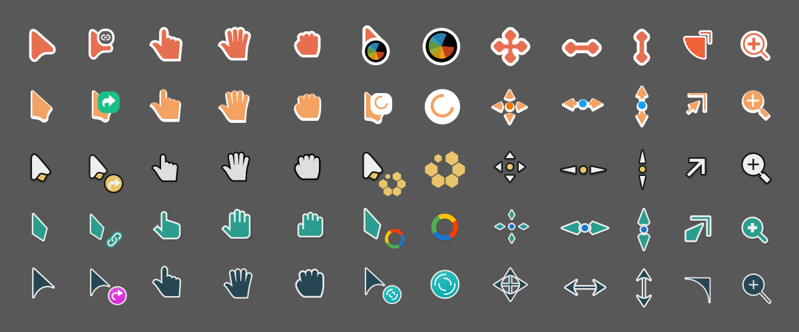

# assets

`accurse` allows you to package cursors of different colors and sizes from the
same set of assets. This directory contains a few popular cursor themes along
with the necessary `metadata.toml` files as reference. I pulled the SVGs from
the following repositories and modified them.

- [Bibata by ful1e5](https://github.com/ful1e5/Bibata_Cursor) (GPL-3.0)
- [Breeze by ful1e5](https://github.com/ful1e5/BreezeX_Cursor) (GPL-3.0)
- [Future by yeyushengfan258](https://github.com/yeyushengfan258/Future-cursors) (GPL-3.0)
- [Vimix by vinceliuice](https://github.com/vinceliuice/Vimix-cursors) (GPL-3.0)
- [Volantes by varlesh](https://github.com/varlesh/volantes-cursors) (GPL-2.0)

